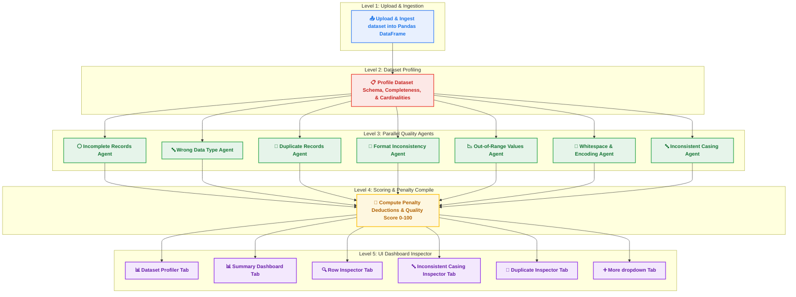

# 📊 System Workflow Diagram

This document contains the Mermaid diagram code representing the complete workflow of the Data Quality & Discrepancy Detection System, alongside descriptions of each level.

---

## 🗺️ Mermaid Diagram Code

You can render this diagram directly on GitHub or in any Markdown editor supporting Mermaid:



---

## 📝 Workflow Levels Described

1. **Level 1: Upload & Ingestion (Soft Blue)**
   - The user uploads a `.csv` or `.xlsx` file, which is ingested directly into a Pandas DataFrame in a single step.

2. **Level 2: Dataset Profiling (Soft Red)**
   - The system profiles the dataset dimensions, data types, completeness, and value cardinalities in a single profiling step.

3. **Level 3: Parallel Quality Agents (Soft Green)**
   - **7 active inspection agents** execute check constraints:
     - *Incomplete Records*: Blank and missing values scan.
     - *Wrong Type*: 70% majority datatype inference and validation.
     - *Duplicate Records*: Hashing exact copies and transitively grouping fuzzy matches.
     - *Format Inconsistency*: Pattern collapsed template checks.
     - *Out-of-Range*: logical limits check and normality-aware fallback checks.
     - *Whitespace & Encoding*: Regex space checks and Latin-1 encoding audits.
     - *Inconsistent Casing*: case variants collisions detector with a 50% dominant group threshold.

4. **Level 4: Scoring & Penalty Compile (Soft Yellow)**
   - A single compilation step gathers all agent findings, sorts them by criticality, computes penalty deductions, and outputs a final Quality Score between 0 and 100.

5. **Level 5: UI Dashboard Inspector (Soft Purple)**
   - Tabulates findings into the interactive view modules, including:
     - Standard summaries and drill downs.
     - Casing group update tables.
     - Toggle-driven Exact vs Near-Duplicate comparison grids.
     - Drop-down menu options (Findings details, Altair visualization charts, Documentation).

---

## 🤖 Prompt to Rebuild/Customize Chart

If you need to feed this workflow description to another AI agent to recreate or customize the Mermaid diagram, you can use the following prompt:

```text
Create a Mermaid flow diagram (TD) representing a data quality audit workflow, colored by level using classDef. 

There must be 5 levels of subgraphs:
1. "Level 1: Upload & Ingestion" (Single Node: Upload & Ingest dataset into Pandas). Use light blue (#E8F0FE) fill with blue stroke.
2. "Level 2: Dataset Profiling" (Single Node: Profile Dataset Schema & Statistics). Use light red (#FCE8E6) fill with red stroke.
3. "Level 3: Parallel Quality Agents" (7 Nodes: Incomplete, Wrong Type, Duplicates, Format Inconsistency, Out of Range, Whitespace, Casing). Use light green (#E6F4EA) fill with green stroke.
4. "Level 4: Scoring & Penalty Compile" (Single Node: Compute Penalty Deductions & Quality Score). Use light yellow (#FEF7E0) fill with orange/yellow stroke.
5. "Level 5: UI Dashboard Inspector" (6 Nodes representing dashboard tabs: Profiler, Summary, Row Inspector, Casing Inspector, Duplicate Inspector, More options dropdown). Use light purple (#F3E8FD) fill with purple stroke.

Ensure each node on the same level is styled with the same class Def for visual consistency.
```
